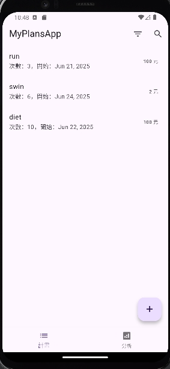
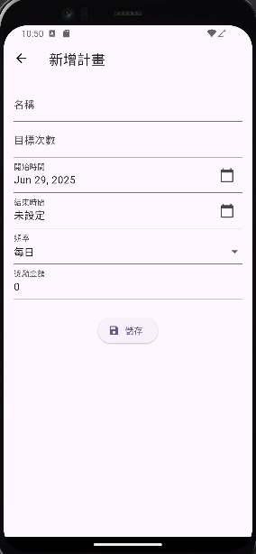
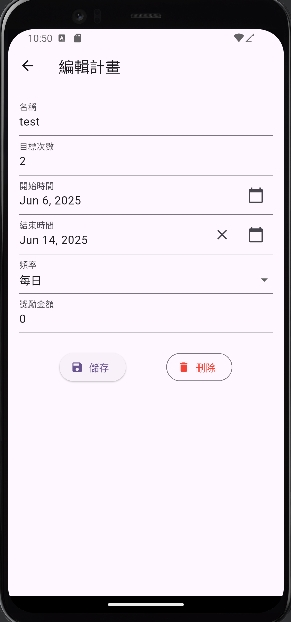
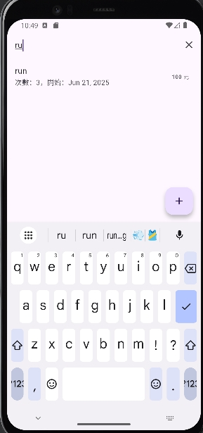
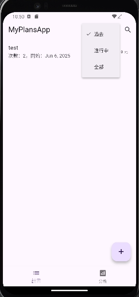

# 📌 MyPlansApp — Flutter Demo

一個使用 **Flutter** 開發的跨平台計畫記錄與分析 Demo，  
展示完整的 CRUD、SQLite 儲存、AppBar 工具列、搜尋與篩選功能。

---

## 🛠 使用技術

- Flutter (跨平台開發)
- SQLite (本地資料庫)
- setState (狀態管理)
- Material Icons 與內建 Widgets
- IndexedStack + BottomNavigationBar (多頁切換)
- PopupMenuButton (下拉選單)
- DatePicker、TextFormField、DropdownButtonFormField (表單組件)

---

## 🚀 專案功能

- ✅ 登入頁（點擊直接跳轉首頁）
- ✅ 計畫列表頁（CRUD、搜尋、日期篩選）
- ✅ 明細頁（名稱、目標次數、開始時間、結束時間、頻率、獎勵金額）
- ✅ SQLite 本地化[儲存]
- ✅ AppBar [搜尋框]切換
- ✅ Filter [過濾]選單 (過去、今日、全部)
- ✅ BottomNavigationBar 頁面切換 (計畫 / 分析)
- ✅ Analysis 分析頁可擴式的設計

---

## 📦 啟動方式

```bash
# 確保你已經安裝 Flutter
flutter --version
flutter doctor

# 安裝相依套件
flutter pub get

# 啟動模擬器或連接真機
# 在 Android 模擬器執行，啟動Android Studio AVD(API33)
# 執行專案 (Debug 模式 vscode F5)
flutter run
```
## 🎉 tada Android AVD 圖: 







## 📱 APK 安裝包(min Android 13)：
https://github.com/wckuo777/FlutterBasic/releases/tag/Fultter_v1.0.0
